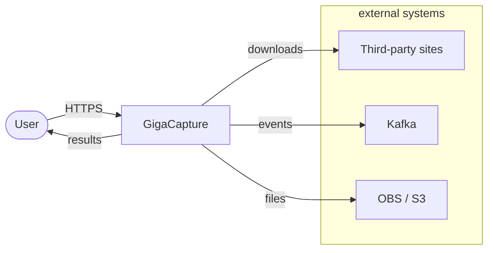
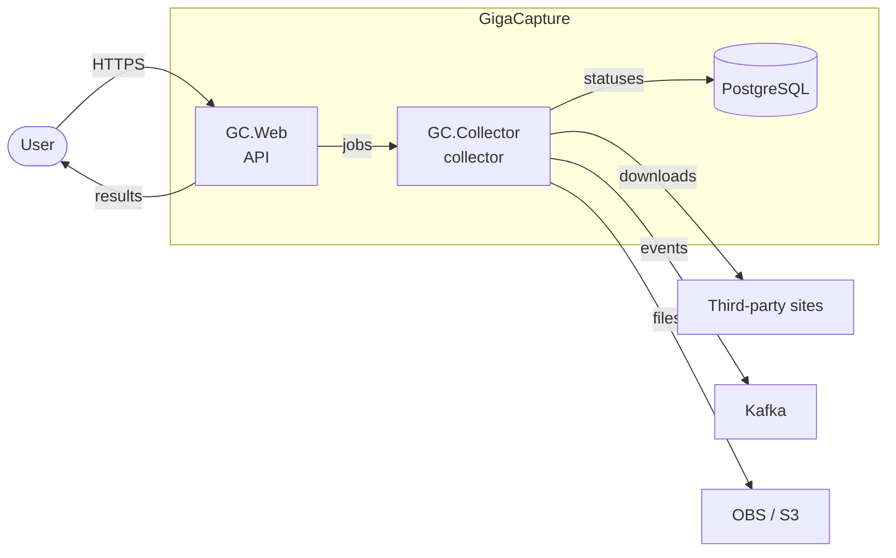

# Architecture rules

## Layer principles

- A route handler contains only HTTP logic: deserialization, validation, calling the service, building the response.
- All business logic lives in the service layer.
- The repository is responsible for data access (SQLAlchemy models, queries).
- The domain layer holds entities, dataclasses, Pydantic models, and TypeAliases — with no dependencies on infrastructure.
- Do not allow layer mixing: a service does not import a router; a router does not go to the DB directly.
- Avoid over-engineering: add a layer only when it is needed, not on assumptions.

## When an architecture document is needed

Write an `.md` document with a plan before starting the implementation if the task:

- Adds a new component (a service, a worker, an integration with an external system).
- Changes a public API or a data contract between services.
- Touches the DB schema non-trivially (a new table, changing the PK type, partitioning).
- Requires coordinating two or more repositories.
- Carries performance or security risks.

For tasks of > 1 day of work, an architecture document is mandatory.

## C4 diagrams: rules

We use **only the top two levels**:

| Level | Purpose | Mandatory |
|---------|-----------|------------|
| **C1 — Context** | The system as a whole + users + external systems | Yes, always |
| **C2 — Container** | Services, databases, queues, storage | Yes, always |
| C3 — Component | Internal components of a single container | Optional, if the internals are complex |
| C4 — Code | Classes and functions | Not used in documents |

Diagrams are drawn in **Mermaid** (`graph LR` or `C4Context`/`C4Container`).

### C1 — Context template

Person → one System → System_Ext. Internal services (Web/Collector) — only on C2.



### C2 — Container template

Containers/services and stores — not Router/Service classes (that is C3).



## Architectural decisions (ADR-lite)

Record every non-trivial technical decision as a block in a section of the document:

```markdown
### Decision N: <short name>

**Chosen:** <what we are doing>
**Alternatives:** <what was considered and why it was not taken>
**Consequences:** <what gets better / worse / which risks remain>
```

ADR-lite is not a replacement for a full ADR file. If the decision is critical (changing the framework, the storage, the interaction pattern) — create a separate ADR via the `docs` skill.

## Python specifics

- A new strategy component → inherit from an existing base class (DataExtractor, BaseRepository, etc.); do not create a parallel hierarchy.
- Concurrency: `asyncio.TaskGroup` + `asyncio.Semaphore` to bound parallelism; `multiprocessing.Process` only for CPU-bound or isolated I/O.
- Retry: `tenacity` with exponential backoff; put the settings in `Settings` (pydantic-settings), do not hardcode them.
- Limits (file size, total volume, object count) — named constants in `const.py`, documented in the architecture document.
- External dependencies (httpx, aioboto3, tenacity) — only if no existing tool in the project does the job.
