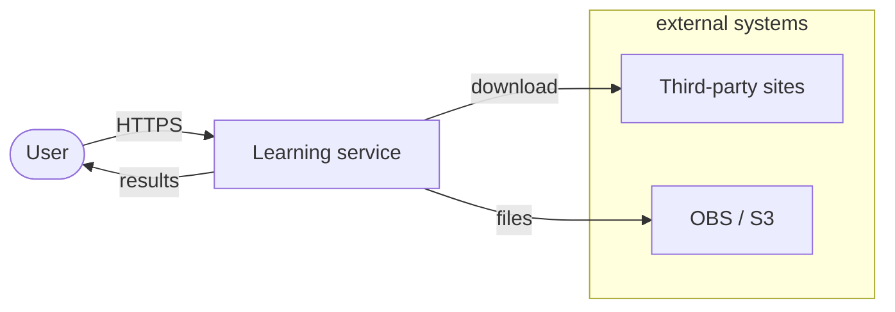
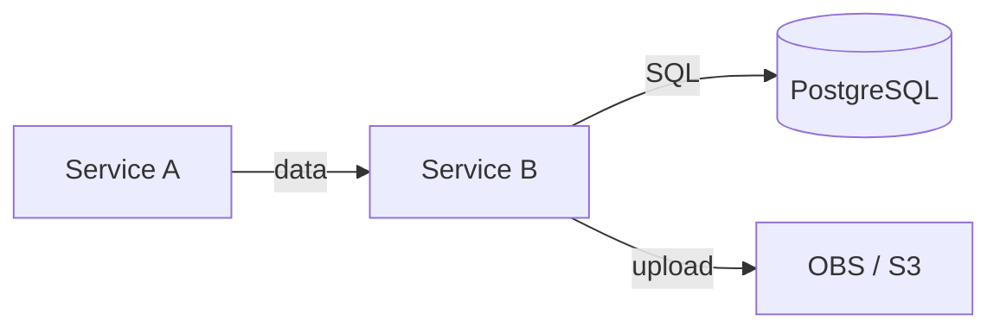

# Skill: Architecture

## Goal

Write an architecture document before implementation starts.
The document is a work plan, not an academic report:
it captures **what** we are building, **why this way**, and **how it is split into tasks**.

Read `.agents/agents/architecture.md` before starting — it contains the layering principles and C4 rules.

---

## Algorithm

### 1. Break down the task

- Read the Jira ticket (or the feature description).
- Capture the **DoD** — what must be true after implementation.
- Write out the constraints: limits (size, count), allowed formats, SLA, security.
- Identify the affected repositories: one or several?

### 2. Study the codebase

- Find extension points: base classes, interfaces, patterns (Strategy, Repository, Service).
- Understand the current data flow: from the user request to the response / event / DB write.
- Check `Settings` — which settings already exist, what to add.
- Find the existing `const.py` — add new constants there, do not hardcode.

### 3. C4 diagrams (mandatory)

Draw **two levels** — no more, no less (see `.agents/agents/architecture.md`):

**C1 — Context:** one system + the user + external systems (OBS, Kafka, third-party sites). Not two services without a system boundary.



**C2 — Container:** services, databases, queues, storage. Not classes/routers inside a service (that is C3).



Rule: every rectangle is either a process/service or a data store. Do not draw functions or classes.

### 4. Component model

A table with three parts:

| Part | What to describe |
|-------|--------------|
| **Existing** | Components we use unchanged |
| **New** | New classes, modules, endpoints |
| **Modified** | Existing files/classes we edit |

For each new class — one line: name, layer, purpose.

### 5. Architecture decisions

A numbered list. For each decision:

```
### Decision N: <title>
**Chosen:** <what exactly>
**Alternatives:** <what was considered>
**Consequences:** <trade-offs>
```

Typical decisions for a Python backend:

- Extension pattern (Strategy, Observer, Template Method).
- Concurrency model (asyncio.Semaphore, multiprocessing, ThreadPool).
- Retry strategy (tenacity parameters: wait, stop, retry_on).
- Where to keep state (in-memory, Redis, Postgres).
- How to split into tasks (if the dependency between T1 and T2 is not obvious).

### 6. Data contracts

Show **only the changes** to contracts. Do not rewrite everything — only the delta:

- New/changed Pydantic models (fields, types, validators).
- New/changed API endpoints (method, path, body, response).
- New Kafka messages or changes to existing ones.
- If two repositories are involved — state explicitly what is copied to the API mirror.

Use a table, not code (except for complex cases with validators):

| Field | Type | Required | Description |
|------|-----|------------|---------|
| `obs_url` | `str` | Yes | Link to the file in OBS |

### 7. File list

Table: repository → file → action (create / modify) → one line on what changes.

| Repository | File | Action | What changes |
|------------|------|---------|-------------|
| service-a-scraper | `src/extractors/files.py` | Create | FilesExtractor |

### 8. Task breakdown

Breakdown principles:
- One task ≈ no more than 1 day of work including tests.
- Tasks are independent where possible; if there is a dependency — make it explicit (T2 requires T1).
- Order: contracts and interfaces first (T1), then implementation (T2-T3), then integration (T4).

For each task — a Jira-ready block:

```
### T1: <title>

**Branch:** `feature/<JIRA-KEY>-<slug>`
**Repository:** <repo>
**Goal:** <one sentence>

**What to do:**
- [ ] item 1
- [ ] item 2

**DoD:**
- [ ] tests written and green
- [ ] ruff + basedpyright + pytest ✅
- [ ] code reviewed
```

### 9. Risks

Table with priority:

| 🔴/🟡/🟢 | Risk | Likelihood | Impact | Mitigation |
|----------|------|------------|---------|----------|
| 🔴 | ... | High | Blocks the release | ... |
| 🟡 | ... | Medium | Degradation | ... |
| 🟢 | ... | Low | Minor | ... |

### 10. Final document check

- [ ] C1 and C2 diagrams are present and correct.
- [ ] The DoD is stated concretely (not "build the feature", but "method X returns Y").
- [ ] All limits are extracted into named constants and mentioned.
- [ ] Every non-trivial decision is documented in the "Decisions" section.
- [ ] Tasks are split by the ≤ 1 day principle, each has a DoD.
- [ ] The affected repositories are listed explicitly at the top of the document.

---

## Structure of the final document

```
# <JIRA-KEY>: <task title>

> ⚠ Affected repositories: ...

## 1. Context and goal
## 2. DoD and constraints
## 3. Diagrams (C1, C2)
## 4. Component model
## 5. Architecture decisions
## 6. Data contracts
## 7. File list
## 8. Tasks (T1–TN)
## 9. Risks
## 10. Standards and checks
```

---

## Example prompt for the agent

```
Read .agents/agents/architecture.md and .agents/skills/architecture.md.

Task: <JIRA-KEY> — <title>.
Description: <text from Jira>.

Study the code in <path to repository>.

Write an architecture document following the algorithm in .agents/skills/architecture.md —
follow the skill without duplicating its rules.

Save it to Tasks/<JIRA-KEY>/<JIRA-KEY>-architecture.md.
```

---

## Requirements for tasks T1-TN: machine-readable format

The document is handed to the developer agent directly. Each task must be **self-contained** — the developer must not need to ask any clarifying questions.

### Mandatory task template

```markdown
### T<N>: <title>

**Depends on:** T<M> (or "no dependencies")
**Branch:** `feature/<JIRA-KEY>-t<N>-<slug>`
**Repositories:** <list>

#### Context
<One or two sentences: why this task exists, what it unblocks>

#### Exact changes

| File | Action | What to do |
|------|---------|------------|
| `src/extractors/files.py` | Create | Class `FilesExtractor(DataExtractor)` |
| `src/settings.py` | Modify | Add fields `max_file_size_bytes`, `max_total_size_bytes` |
| `src/const.py` | Modify | Constants `MAX_FILE_SIZE_BYTES = 31_457_280`, `ALLOWED_MIME_TYPES` |

#### Contract (interface)
<!-- Minimal Python pseudocode: signatures only, no bodies -->
```python
class FilesExtractor(DataExtractor):
    async def extract(self, page: Page, url: str) -> list[FileDownloadResult]: ...

class FileDownloadResult(BaseModel):
    obs_url: str
    s3_key: str
    success: bool
    attempts: int
    error: str | None = None
```

#### What NOT to do in this task
<!-- Explicit boundaries: what is left for the next task -->
- Do not implement the ScrapeService integration (that is T3).
- Do not change the API schemas (that is T1).

#### DoD — verifiable commands
```bash
uv run pytest tests/unit/test_files_extractor.py -v   # all tests green
uv run ruff check src/
uv run basedpyright src/
# For tasks with API changes:
curl -X POST http://localhost:8000/api/v1/scrape \
  -H 'Content-Type: application/json' \
  -d '{"url": "https://example.com", "formats": ["files"]}' \
  | jq '.files[0].obs_url'  # must return a non-empty string
```
```

### Signs of a bad task (the architect checks before finalizing)

| Problem | How to fix |
|---------|--------------|
| "Implement FilesExtractor" with no details | Add an "Exact changes" table with paths and names |
| DoD = "tests written" | DoD = a concrete command `pytest tests/unit/test_X.py` |
| No "What NOT to do" section | Add explicit task boundaries |
| Contract not specified | Add pseudocode with method signatures |
| Vague "Modify settings.py" | Be precise: "Add field `max_file_size: int = 31_457_280`" |

---

## Self-eval: architect's checklist before handoff

Before handing the document to the developer, the architect answers these questions:

### Completeness

- [ ] Can the developer pick up task T1 and start work **without a single clarifying question**?
- [ ] For each new class, is the base class specified plus at least 1 method with a signature?
- [ ] For each modified file, is it explicitly stated: **what to add / what to change / what to delete**?
- [ ] Are constants and limits concrete numbers, not "a reasonable value"?
- [ ] Are dependencies between tasks stated explicitly ("T2 depends on T1")?

### Testability

- [ ] Does the DoD of each task contain a bash command that can be run and yields pass/fail?
- [ ] For tasks with API changes — is there a curl / httpx request example with the expected response?
- [ ] Are unit tests in the DoD listed separately from integration tests?

### Security and quality

- [ ] Is SSRF protection mentioned if the task makes HTTP requests to external URLs?
- [ ] Are limits (file size, object count) verified on input, not only on output?
- [ ] Does the retry strategy document which errors to retry and which not?

### Architectural cleanliness

- [ ] Does the new code avoid mixing layers (router → service → repository)?
- [ ] Is no parallel hierarchy created next to the existing one?
- [ ] If two repositories are involved — is it stated explicitly what gets mirrored and when?

---

## Prompt for the developer agent

After the architecture document passes self-eval, hand the developer this prompt:

```
Read .agents/AGENTS.md, .agents/agents/architecture.md, .agents/agents/python-standards.md.
Read the architecture document: Tasks/<JIRA-KEY>/<JIRA-KEY>-architecture.md.

Complete task <T_N> from the "Tasks" section of this document.

Execution rules:
1. Create the branch from the document (the "Branch" field in the task).
2. Modify only the files from the "Exact changes" table — nothing more.
3. Implement exactly the contract from the "Contract" section — do not add extras.
4. Do not do anything explicitly listed under "What NOT to do".
5. After implementation, run the commands from the "DoD" section — all must be green.
6. Commit message: `[agent] feat(<scope>): <what was done>`.

If along the way you find a contradiction in the document or missing information —
stop and report to the architect; do not fill in the gaps on your own.
```

---

## Eval: how to verify the quality of the architecture document

Run after writing the document, before handing it to the developer.

### Automated checks (bash)

```bash
ARCH_DOC="Tasks/<JIRA-KEY>/<JIRA-KEY>-architecture.md"

# 1. C4 diagrams are present
grep -c 'flowchart LR\|graph LR\|C4Context\|C4Container' "$ARCH_DOC" | awk '{if($1>=2) print "✅ C4: ok"; else print "❌ C4: no diagrams"}'

# 2. Every task has a DoD with bash commands
grep -c '```bash' "$ARCH_DOC" | awk -v n=$(grep -c '### T[0-9]' "$ARCH_DOC") '{if($1>=n) print "✅ DoD bash: ok"; else print "❌ DoD bash: not on every task"}'

# 3. No magic numbers without a constant
grep -E '\b(1024|2048|30|100|500)\b' "$ARCH_DOC" | grep -v 'const\|BYTES\|SIZE\|MAX\|MIN' \
  && echo "⚠ Possible magic numbers without a named constant"

# 4. All repositories are mentioned explicitly
grep -E 'service-a-scraper|service-a-api|harvest_api' "$ARCH_DOC" | head -3
```

### Manual check (5 minutes)

Take task T1 from the document and walk through it as if you were the developer agent:

1. Can I create the branch without questions? → is the branch name specified?
2. Can I open the right files? → are the paths exact, not "somewhere in src"?
3. Do I know the interface of what I need to write? → is the pseudocode there?
4. Do I know the task boundaries? → is there a "What NOT to do" section?
5. Can I verify the result without manual testing? → are bash commands in the DoD?

If even one answer is "no" — the document is not ready.
